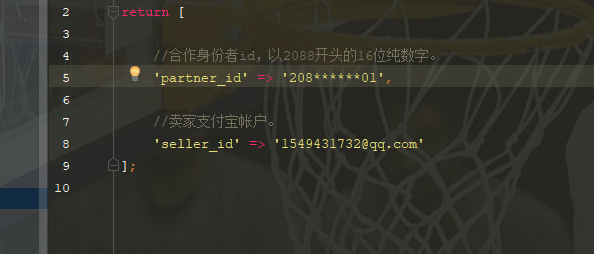
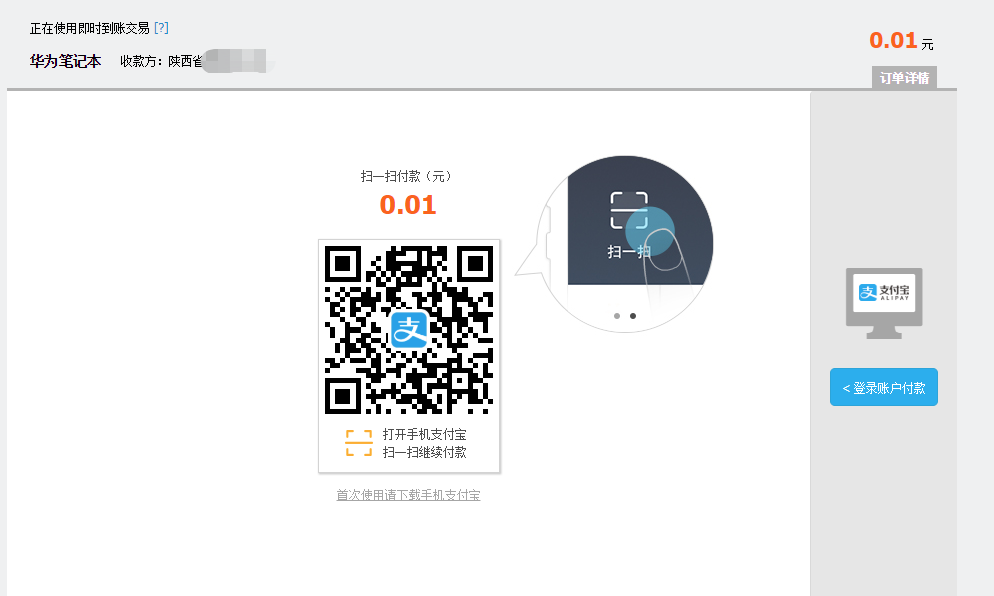

# 支付宝pc扫码支付+移动端网页支付
    框架 laravel5.4
## pc扫码
##### Terminal 执行命令下载安装包
 ```   
 composer  require latrell/ailipay dev-master
 composer update
 ```
 #####  config/app.php文件中添加服务提供者
 ```
        Latrell\Alipay\AlipayServiceProvider::class
 ```
#####   执行命令 生成配置文件
```
php artisan vendor:publish   选择ali支付
```
如果执行成功会在config文件下生成如下三个文件


#####  在文件latrell-alipay-web.php 中设置安全检验码和通知页面

#####  在文件latrell-alipay.php 中设置合作者id


## pc扫码支付 效果图


